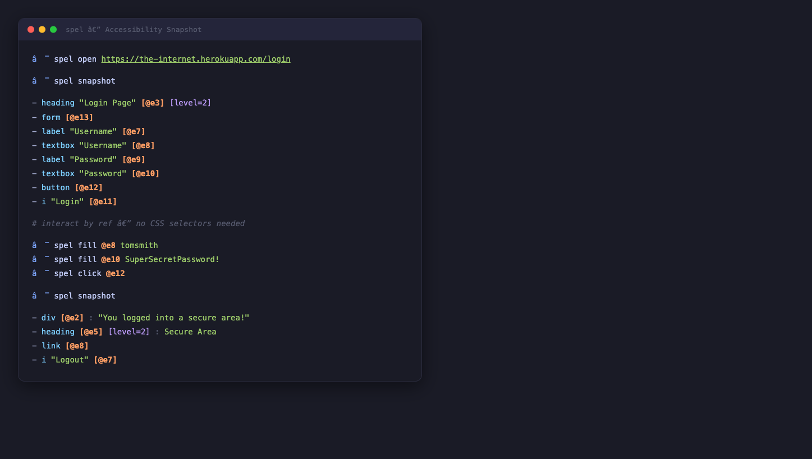
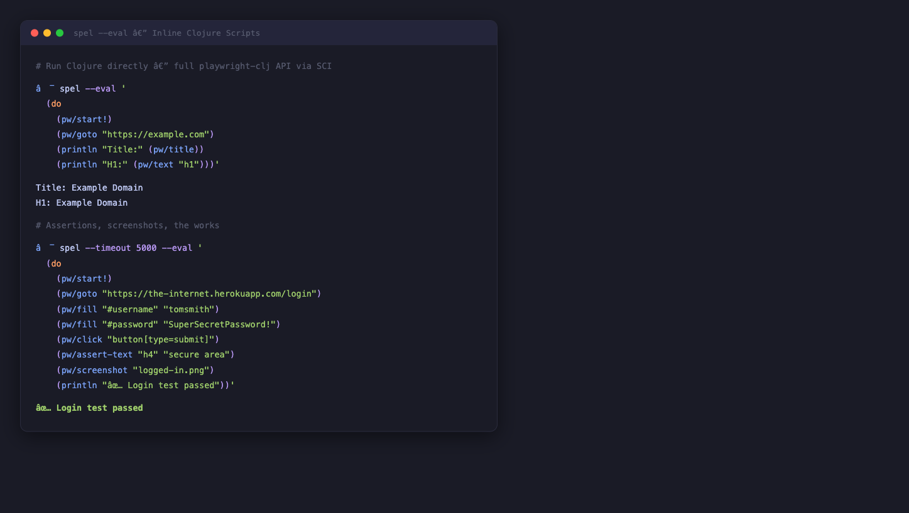
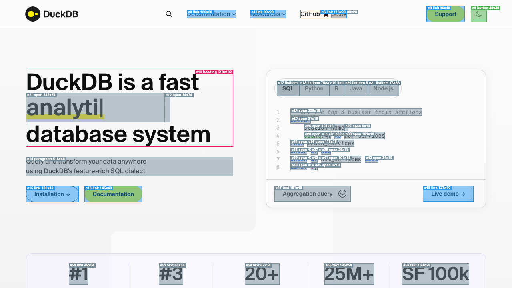
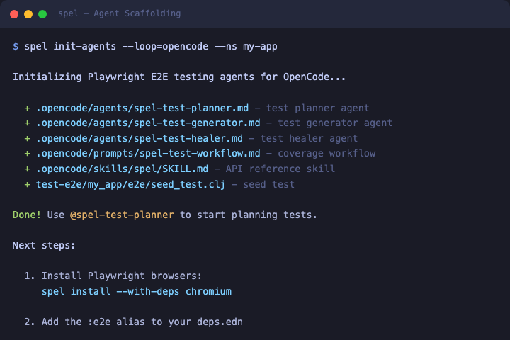
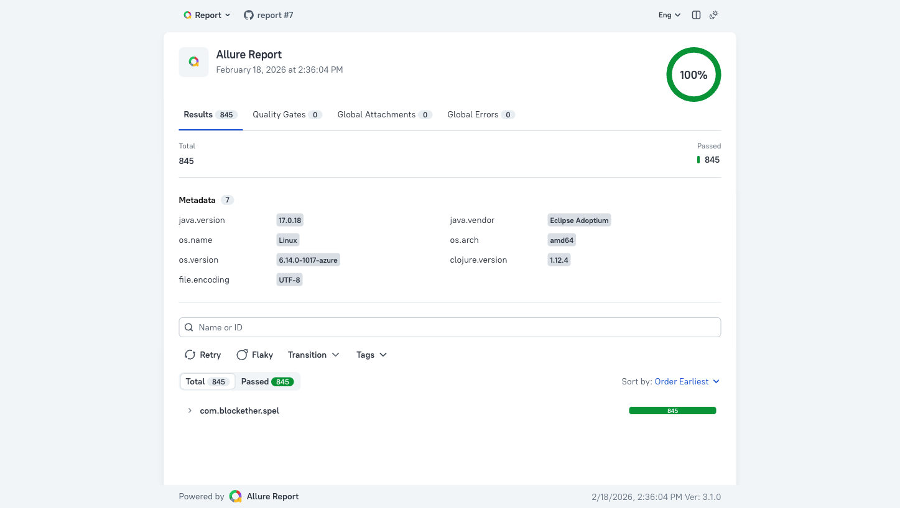
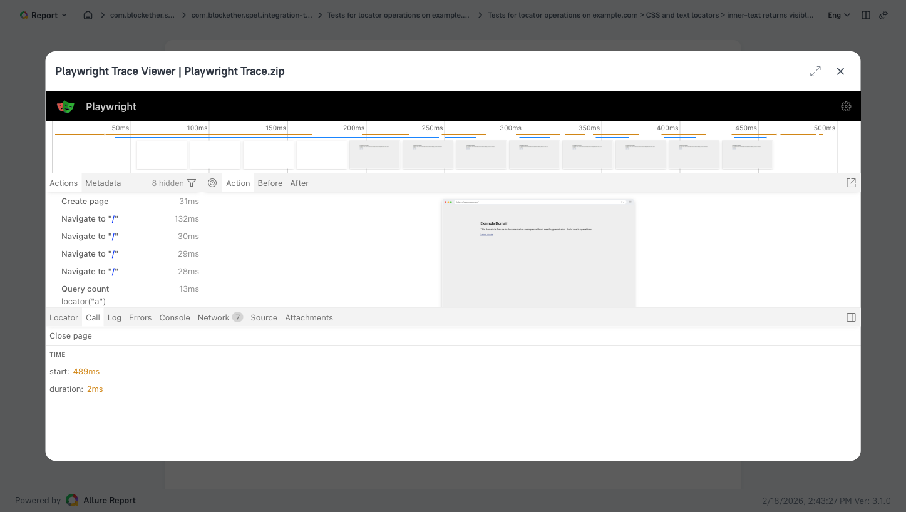

<p align="center">
  
</p>

<div align="center">
<i>spel</i> - Idiomatic Clojure wrapper for <a href="https://playwright.dev/">Microsoft Playwright</a>.
<br/>
<sub>Browser automation, API testing, test reporting, and native CLI — for Chromium, Firefox, and WebKit.</sub>
</div>

<div align="center">
  <h2>
    <a href="https://clojars.org/com.blockether/spel"></a>
    <a href="https://github.com/Blockether/spel/blob/main/LICENSE">
      
    </a>
    <a href="https://blockether.github.io/spel/">
      
    </a>
  </h2>
</div>

<div align="center">
<h3>

[Rationale](#rationale) • [Quick Start](#quick-start) • [Usage](#usage) • [API Testing](#api-testing) • [Allure Reporting](#allure-test-reporting) • [Native CLI](#native-cli)

</h3>
</div>

<table>
<tr>
<td width="25%" align="center"><b>Accessibility Snapshots</b></td>
<td width="25%" align="center"><b>Inline&nbsp;Clojure&nbsp;via&nbsp;--eval</b></td>
<td width="25%" align="center"><b>Visual Annotations</b></td>
<td width="25%" align="center"><b>Agent Scaffolding</b></td>
</tr>
<tr>
<td></td>
<td></td>
<td></td>
<td></td>
</tr>
</table>

## Rationale

Playwright's Java API is imperative and verbose — option builders, checked exceptions, manual resource cleanup. Clojure deserves better.

spel wraps the official Playwright Java 1.58.0 library with idiomatic Clojure: maps for options, anomaly maps for errors, `with-*` macros for lifecycle, and a native CLI binary for instant browser automation from the terminal.

- **Data-driven**: Maps for options, anomaly maps for errors — no option builders, no checked exceptions
- **Composable**: `with-*` macros for lifecycle management — resources always cleaned up
- **Agent-friendly**: Accessibility snapshots with numbered refs, persistent browser daemon, and `--eval` scripting — built for AI agents to see, decide, and act
- **Record & replay**: Record browser sessions to JSONL, transform to idiomatic Clojure tests or scripts
- **Batteries included**: API testing, Allure reporting with embedded Playwright traces, agent scaffolding for Claude/VS Code/OpenCode
- **Not a port**: Wraps the official Playwright Java library directly — full API coverage, same browser versions

## Quick Start

```clojure
;; deps.edn
{:deps {com.blockether/spel {:mvn/version "0.0.1"}}}
```

```bash
spel install  # requires spel CLI — see "As a Native CLI Binary" below
```

```clojure
(require '[com.blockether.spel.core :as core]
         '[com.blockether.spel.page :as page]
         '[com.blockether.spel.locator :as locator])

(core/with-playwright [pw]
  (core/with-browser [browser (core/launch-chromium pw {:headless true})]
    (core/with-context [ctx (core/new-context browser)]
      (core/with-page [pg (core/new-page-from-context ctx)]
        (page/navigate pg "https://example.com")
        (println (locator/text-content (page/locator pg "h1")))))))
;; => "Example Domain"
```

### As a Native CLI Binary

#### Releases

Download from [GitHub releases](https://github.com/Blockether/spel/releases):

```bash
# macOS (Apple Silicon)
curl -LO https://github.com/Blockether/spel/releases/latest/download/spel-macos-arm64
chmod +x spel-macos-arm64 && mv spel-macos-arm64 /usr/local/bin/spel

# Linux (amd64)
curl -LO https://github.com/Blockether/spel/releases/latest/download/spel-linux-amd64
chmod +x spel-linux-amd64 && sudo mv spel-linux-amd64 /usr/local/bin/spel

# Linux (arm64)
curl -LO https://github.com/Blockether/spel/releases/latest/download/spel-linux-arm64
chmod +x spel-linux-arm64 && sudo mv spel-linux-arm64 /usr/local/bin/spel

# Windows (PowerShell)
Invoke-WebRequest -Uri https://github.com/Blockether/spel/releases/latest/download/spel-windows-amd64.exe -OutFile spel.exe
Move-Item spel.exe "$env:LOCALAPPDATA\Microsoft\WindowsApps\spel.exe"
```

#### macOS Gatekeeper

The binaries are not signed with an Apple Developer certificate. macOS will block the first run with *"spel can't be opened because Apple cannot check it for malicious software"*. To allow it:

```bash
# Remove the quarantine attribute (recommended)
xattr -d com.apple.quarantine /usr/local/bin/spel
```

Or: **System Settings → Privacy & Security → scroll down → click "Allow Anyway"** after the first blocked attempt.

#### Post-install

Install browsers and verify:

```bash
spel install
spel version
```

## Usage

### Browser Lifecycle

All browser work starts with nested `with-*` macros that guarantee resource cleanup:

```clojure
(require '[com.blockether.spel.core :as core])

(core/with-playwright [pw]
  (core/with-browser [browser (core/launch-chromium pw {:headless true})]
    (core/with-context [ctx (core/new-context browser)]
      (core/with-page [pg (core/new-page-from-context ctx)]
        ;; Your code here — pg is a fresh Page
        ))))
```

Launch specific browser engines:

```clojure
(core/launch-chromium pw {:headless true})
;; Also: launch-firefox, launch-webkit

;; Browser queries
(core/browser-connected? browser)
;; => true

(core/browser-version browser)
;; => "136.0.7103.25"

(core/browser-contexts browser)
;; => [#object[BrowserContext ...]]
```

| Macro | Cleans Up |
|-------|-----------|
| `with-playwright` | Playwright instance |
| `with-browser` | Browser instance |
| `with-context` | BrowserContext |
| `with-page` | Page instance |

### Page Operations

```clojure
(require '[com.blockether.spel.page :as page])

;; Navigation
(page/navigate pg "https://example.com")
(page/navigate pg "https://example.com" {:timeout 30000})
(page/go-back pg)
(page/go-forward pg)
(page/reload pg)

;; Page state
(page/url pg)
;; => "https://example.com/"

(page/title pg)
;; => "Example Domain"

(page/content pg)
;; => "<!DOCTYPE html><html>..."

(page/is-closed? pg)
;; => false
```

Locators — find elements by CSS, text, role, label, or test ID:

```clojure
;; By CSS
(page/locator pg "h1")
(page/locator pg "#my-id")

;; By text
(page/get-by-text pg "Click me")

;; By role (requires AriaRole import)
(page/get-by-role pg AriaRole/BUTTON)

;; By label
(page/get-by-label pg "Email")

;; By placeholder
(page/get-by-placeholder pg "Enter email")

;; By test ID
(page/get-by-test-id pg "submit-btn")
```

Screenshots and PDF:

```clojure
;; Screenshot as byte array
(page/screenshot pg)

;; Screenshot to file with options
(page/screenshot pg {:path "screenshot.png" :full-page true})

;; PDF (Chromium only)
(page/pdf pg)
```

JavaScript evaluation:

```clojure
(page/evaluate pg "document.title")
;; => "Example Domain"
```

Page events:

```clojure
(page/on-console pg (fn [msg] (println (.text msg))))
(page/on-dialog pg (fn [dialog] (.dismiss dialog)))

;; Network routing (requires network ns for route handlers)
(page/route! pg "**/api/**"
  (fn [route] (net/route-fulfill! route {:status 200 :body "mocked"})))
```

### Locators

All locator actions and queries:

```clojure
(require '[com.blockether.spel.locator :as locator])

;; Actions
(locator/click loc)
(locator/click loc {:click-count 2})
(locator/dblclick loc)
(locator/fill loc "text")
(locator/type-text loc "text")
(locator/press loc "Enter")
(locator/press loc "Control+a")
(locator/clear loc)
(locator/check loc)
(locator/uncheck loc)
(locator/hover loc)
(locator/focus loc)
(locator/select-option loc "value")
(locator/set-input-files! loc "/path/to/file.txt")
(locator/set-input-files! loc ["/path/a.txt" "/path/b.txt"])

;; State queries
(locator/text-content loc)
;; => "Example Domain"

(locator/inner-text loc)
;; => "Example Domain"

(locator/input-value loc)
;; => "user@example.com"

(locator/get-attribute loc "href")
;; => "https://www.iana.org/domains/examples"

(locator/is-visible? loc)
;; => true

(locator/is-enabled? loc)
;; => true

(locator/is-checked? loc)
;; => false

(locator/bounding-box loc)
;; => {:x 100.0 :y 50.0 :width 200.0 :height 30.0}

(locator/count-elements loc)
;; => 3
```

Filtering and positioning:

```clojure
;; Filter by text or sub-locator
(locator/loc-filter loc {:has-text "Submit"})

;; Position-based selection
(locator/first-element loc)
(locator/last-element loc)
(locator/nth-element loc 2)

;; Sub-locators
(locator/loc-locator (page/locator pg ".card") "h2")
(locator/loc-get-by-text (page/locator pg ".card") "Title")

;; Locator screenshots
(locator/locator-screenshot loc)
(locator/highlight loc)
```

### Assertions

Assertion functions take assertion objects, not raw locators/pages. Create them with `assert-that` first. All assertions return `nil` on success, throw on failure.

```clojure
(require '[com.blockether.spel.assertions :as assert])

;; Locator assertions — assert-that returns LocatorAssertions
(let [la (assert/assert-that (page/locator pg "#btn1"))]
  (assert/has-text la "Click Me")
  (assert/contains-text la "Click")
  (assert/has-attribute la "data-test" "submit")
  (assert/has-class la "active")
  (assert/has-css la "color" "rgb(0, 0, 0)")
  (assert/has-id la "btn1")
  (assert/has-value la "hello")
  (assert/has-count la 1)
  (assert/is-visible la)
  (assert/is-enabled la)
  (assert/is-checked la)
  (assert/is-focused la)
  (assert/is-empty la)
  (assert/is-attached la))

;; Page assertions — assert-that returns PageAssertions
(let [pa (assert/assert-that pg)]
  (assert/has-title pa "Example Domain")
  (assert/has-url pa #"example\.com"))

;; API response assertions
(assert/is-ok (assert/assert-that api-response))
```

Negation — flip assertion expectation:

```clojure
;; Locator negation
(assert/is-visible (assert/loc-not (assert/assert-that (page/locator pg ".hidden"))))

;; Page negation (page-not takes PageAssertions, not Page)
(assert/has-title (assert/page-not (assert/assert-that pg)) "Wrong Title")

;; API response negation (api-not takes APIResponseAssertions)
(assert/is-ok (assert/api-not (assert/assert-that api-response)))
```

In Lazytest `it` blocks, always wrap with `expect`:

```clojure
(expect (nil? (assert/has-text (assert/assert-that (page/locator *page* "h1")) "Welcome")))
(expect (nil? (assert/has-title (assert/assert-that *page*) "My Page")))
```

Set default timeout:

```clojure
(assert/set-default-assertion-timeout! 5000)
```

### Network

```clojure
(require '[com.blockether.spel.network :as net])

;; Response inspection
(let [resp (page/navigate pg "https://example.com")]
  (net/response-status resp)       ;; => 200
  (net/response-status-text resp)  ;; => "OK"
  (net/response-headers resp)      ;; => {"content-type" "text/html" ...}
  (net/response-text resp)         ;; => "<!doctype html>..."
  (net/response-ok? resp))         ;; => true

;; Request inspection
(let [req (net/response-request resp)]
  (net/request-url req)            ;; => "https://example.com/"
  (net/request-method req)         ;; => "GET"
  (net/request-headers req)        ;; => {"accept" "..." ...}
  (net/request-post-data req)      ;; => nil
  (net/request-is-navigation? req));; => true

;; Route handling
(net/route-fulfill! route {:status 200 :body "response" :headers {"Content-Type" "text/plain"}})
(net/route-continue! route)
(net/route-abort! route)
(net/route-fallback! route)
```

### Input

```clojure
(require '[com.blockether.spel.input :as input])

;; Keyboard
(input/key-press keyboard "Enter")
(input/key-type keyboard "text")
(input/key-down keyboard "Shift")
(input/key-up keyboard "Shift")
(input/key-insert-text keyboard "text")

;; Mouse
(input/mouse-click mouse 100 200)
(input/mouse-move mouse 100 200)
(input/mouse-down mouse)
(input/mouse-up mouse)
(input/mouse-wheel mouse 0 100)

;; Touchscreen
(input/touchscreen-tap touchscreen 100 200)
```

### Frames

```clojure
(require '[com.blockether.spel.frame :as frame])

;; Frame navigation and content
(frame/frame-navigate frame "https://example.com")
(frame/frame-url frame)
(frame/frame-title frame)

;; Frame locators
(frame/frame-locator frame "button")
(frame/frame-get-by-text frame "text")
(frame/frame-get-by-role frame AriaRole/BUTTON)

;; FrameLocator (preferred for iframes)
(let [fl (frame/frame-locator-obj pg "iframe")]
  (locator/click (frame/fl-locator fl "button")))

;; Nested frames
(let [fl1 (frame/frame-locator-obj pg "iframe.outer")
      fl2 (.frameLocator (frame/fl-locator fl1 "iframe.inner") "iframe.inner")]
  (locator/click (frame/fl-locator fl2 "button")))

;; Frame hierarchy
(frame/parent-frame frame)
(frame/child-frames frame)
```

### Accessibility Snapshots

Capture the accessibility tree with numbered refs for element interaction:

```clojure
(require '[com.blockether.spel.snapshot :as snapshot])

;; Capture snapshot with refs
(let [snap (snapshot/capture-snapshot pg)]
  (:tree snap)      ;; YAML-like tree: "- heading \"Example Domain\" [ref=e1] [level=1]\n..."
  (:refs snap)      ;; {"e1" {:role "heading" :name "Example Domain" :bbox {...}} ...}
  (:counter snap))  ;; Total refs assigned

;; Resolve ref to locator — click element e3
(let [loc (snapshot/resolve-ref pg "e3")]
  (locator/click loc))

;; Full page with iframes
(snapshot/capture-full-snapshot pg)

;; Clear refs between snapshots
(snapshot/clear-refs! pg)
```

### Error Handling

All wrapped functions return either a value or an anomaly map (via `com.blockether/anomaly`):

```clojure
(let [result (page/navigate pg "https://example.com")]
  (if (anomaly/anomaly? result)
    (println "Error:" (:cognitect.anomalies/message result))
    (println "Navigated!")))
```

| Playwright Exception | Anomaly Category | Error Type |
|---------------------|------------------|------------|
| `TimeoutError` | `:cognitect.anomalies/busy` | `:playwright.error/timeout` |
| `TargetClosedError` | `:cognitect.anomalies/interrupted` | `:playwright.error/target-closed` |
| `PlaywrightException` | `:cognitect.anomalies/fault` | `:playwright.error/playwright` |
| Generic `Exception` | `:cognitect.anomalies/fault` | `:playwright.error/unknown` |

## API Testing

### Creating API Context

```clojure
(require '[com.blockether.spel.core :as core]
         '[com.blockether.spel.api :as api])

;; Single context
(api/with-api-context [ctx (api/new-api-context (api/api-request pw)
                             {:base-url "https://api.example.com"
                              :extra-http-headers {"Authorization" "Bearer token"}})]
  (let [resp (api/api-get ctx "/users")]
    (println (api/api-response-status resp))    ;; 200
    (println (api/api-response-text resp))))     ;; JSON body

;; Multiple contexts
(api/with-api-contexts
  [users   (api/new-api-context (api/api-request pw) {:base-url "https://users.example.com"})
   billing (api/new-api-context (api/api-request pw) {:base-url "https://billing.example.com"})]
  (api/api-get users "/me")
  (api/api-get billing "/invoices"))
```

### HTTP Methods

```clojure
;; GET with params and headers
(api/api-get ctx "/users")
(api/api-get ctx "/users" {:params {:page 1 :limit 10}
                           :headers {"Authorization" "Bearer token"}})

;; POST with JSON body
(api/api-post ctx "/users"
  {:data "{\"name\":\"Alice\"}"
   :headers {"Content-Type" "application/json"}})

;; PUT, PATCH, DELETE, HEAD
(api/api-put ctx "/users/1" {:data "{\"name\":\"Bob\"}"})
(api/api-patch ctx "/users/1" {:data "{\"name\":\"Charlie\"}"})
(api/api-delete ctx "/users/1")
(api/api-head ctx "/health")

;; Custom method
(api/api-fetch ctx "/resource" {:method "OPTIONS"})
```

### JSON Encoding

```clojure
(require '[cheshire.core :as json])

;; Bind JSON encoder for :json option support
(binding [api/*json-encoder* json/generate-string]
  (api/api-post ctx "/users" {:json {:name "Alice" :age 30}}))

;; Or set globally
(alter-var-root #'api/*json-encoder* (constantly json/generate-string))
```

### Form Data

```clojure
;; Build FormData manually
(let [fd (api/form-data)]
  (api/fd-set fd "name" "Alice")
  (api/fd-append fd "tag" "clojure")
  (api/api-post ctx "/submit" {:form fd}))

;; Or from a map
(api/api-post ctx "/submit" {:form (api/map->form-data {:name "Alice" :email "a@b.c"})})
```

### Response Inspection

```clojure
(let [resp (api/api-get ctx "/users")]
  (api/api-response-status resp)       ;; => 200
  (api/api-response-status-text resp)  ;; => "OK"
  (api/api-response-url resp)          ;; => "https://api.example.com/users"
  (api/api-response-ok? resp)          ;; => true
  (api/api-response-headers resp)      ;; => {"content-type" "application/json" ...}
  (api/api-response-text resp)         ;; => "{\"users\":[...]}"
  (api/api-response-body resp)         ;; => #bytes[...]

  ;; Convert to map
  (api/api-response->map resp))
  ;; => {:status 200, :status-text "OK", :url "...", :ok? true, :headers {...}, :body "..."}
```

### Hooks

Request/response interceptors — composable, nestable:

```clojure
;; Request logging
(api/with-hooks
  {:on-request  (fn [method url opts] (println "→" method url) opts)
   :on-response (fn [method url resp] (println "←" method (api/api-response-status resp)) resp)}
  (api/api-get ctx "/users"))

;; Auth injection
(api/with-hooks
  {:on-request (fn [_ _ opts]
                 (assoc-in opts [:headers "Authorization"]
                   (str "Bearer " (get-token))))}
  (api/api-get ctx "/protected"))

;; Composable nesting
(api/with-hooks {:on-response (fn [_ _ resp] resp)}
  (api/with-hooks {:on-request (fn [_ _ opts] opts)}
    (api/api-get ctx "/users")))
```

### Retry

```clojure
;; Default: 3 attempts, exponential backoff, retry on 5xx
(api/retry #(api/api-get ctx "/flaky"))

;; Custom config
(api/retry #(api/api-get ctx "/flaky")
  {:max-attempts 5
   :delay-ms 1000
   :backoff :linear
   :retry-when (fn [r] (= 429 (:status (api/api-response->map r))))})

;; With macro
(api/with-retry {:max-attempts 3 :delay-ms 200}
  (api/api-post ctx "/endpoint" {:json {:action "process"}}))

;; Standalone request (no context setup)
(api/request! pw :get "https://api.example.com/health")
(api/request! pw :post "https://api.example.com/users"
  {:data "{\"name\":\"Alice\"}"
   :headers {"Content-Type" "application/json"}})
```

## Allure Test Reporting

Integrates with [Lazytest](https://github.com/noahtheduke/lazytest) for comprehensive test reports using [Allure](https://allurereport.org/). Compatible with Allure 2+ result format. The built-in reporter generates the full HTML report automatically using Allure 3 (pinned to 3.1.0 via npx) with an embedded local Playwright trace viewer — no external `allure generate` step needed.

> **[View live test report](https://blockether.github.io/spel/)** — 845 tests, 100% pass rate, with embedded Playwright traces.

<table>
<tr>
<td width="50%" align="center"><b>Allure&nbsp;Report</b></td>
<td width="50%" align="center"><b>Embedded&nbsp;Playwright&nbsp;Traces</b></td>
</tr>
<tr>
<td><a href="https://blockether.github.io/spel/"></a></td>
<td><a href="https://blockether.github.io/spel/"></a></td>
</tr>
</table>

### Test Example

```clojure
(ns my-app.test
  (:require
   [com.blockether.spel.assertions :as assert]
   [com.blockether.spel.locator :as locator]
   [com.blockether.spel.page :as page]
   [com.blockether.spel.test-fixtures :refer [*page* with-playwright with-browser with-page]]
   [lazytest.core :refer [defdescribe describe expect it]])
  (:import
   [com.microsoft.playwright.options AriaRole]))

(defdescribe my-test
  (describe "example.com"
    {:context [with-playwright with-browser with-page]}

    (it "navigates and asserts"
      (page/navigate *page* "https://example.com")
      (expect (= "Example Domain" (page/title *page*)))
      (expect (nil? (assert/has-text
                      (assert/assert-that (page/locator *page* "h1"))
                      "Example Domain"))))))
```

### Test Fixtures

| Fixture | Binds | Scope |
|---------|-------|-------|
| `with-playwright` | `*pw*` | Shared Playwright instance |
| `with-browser` | `*browser*` | Shared headless Chromium browser |
| `with-page` | `*page*` | Fresh page per `it` block (auto-cleanup, auto-tracing with Allure) |
| `with-traced-page` | `*page*` | Like `with-page` but always enables tracing/HAR |
| `with-test-server` | `*test-server-url*` | Local HTTP test server |

### Metadata

```clojure
(require '[com.blockether.spel.allure :as allure])

;; Labels
(allure/epic "E2E Testing")
(allure/feature "Authentication")
(allure/story "Login Flow")
(allure/severity :critical)          ;; :blocker :critical :normal :minor :trivial
(allure/owner "team@example.com")
(allure/tag "smoke")

;; Description and links
(allure/description "Tests the complete login flow")
(allure/link "Docs" "https://example.com/docs")
(allure/issue "BUG-123" "https://github.com/example/issues/123")
(allure/tms "TC-456" "https://tms.example.com/456")

;; Parameters
(allure/parameter "browser" "chromium")
```

### Steps

```clojure
;; Lambda step with body
(allure/step "Navigate to login page"
  (page/navigate pg "https://example.com/login"))

;; Nested steps
(allure/step "Login flow"
  (allure/step "Enter credentials"
    (locator/fill (page/locator pg "#user") "admin")
    (locator/fill (page/locator pg "#pass") "secret"))
  (allure/step "Submit"
    (locator/click (page/locator pg "#submit"))))

;; UI step (auto-captures before/after screenshots, requires *page* binding)
(allure/ui-step "Fill login form"
  (locator/fill username-input "admin")
  (locator/fill password-input "secret")
  (locator/click submit-btn))

;; API step (auto-attaches response details: status, headers, body)
(allure/api-step "Create user"
  (api/api-post ctx "/users" {:json {:name "Alice" :age 30}}))
```

### Attachments

```clojure
;; String attachment
(allure/attach "Request Body" "{\"key\":\"value\"}" "application/json")

;; Binary attachment
(allure/attach-bytes "Screenshot" (page/screenshot pg) "image/png")

;; Convenience screenshot
(allure/screenshot pg "After navigation")

;; Attach API response
(allure/attach-api-response! resp)
```

### Running Tests

```bash
# Run with Allure reporter (generates JSON + HTML report + embedded trace viewer automatically)
clojure -M:test --output nested --output com.blockether.spel.allure-reporter/allure

# Or use Make targets
make test-allure     # run tests + generate report
make allure          # run tests + generate + open in browser
```

The reporter handles the full pipeline:
1. Writes Allure JSON results to `allure-results/` (Allure 2+ compatible format)
2. Resolves Allure 3 CLI via `npx allure@3.1.0` (no manual install needed)
3. Generates HTML report to `allure-report/` using `allure awesome`
4. Embeds a local Playwright trace viewer (no dependency on `trace.playwright.dev`)
5. Patches report JS to load traces from `./trace-viewer/` and pre-registers the Service Worker for instant loading
6. Manages run history via `.allure-history.jsonl` (Allure 3 JSONL mechanism, default: last 10 builds)

#### History Configuration

| Property | Env Var | Default | Description |
|----------|---------|---------|-------------|
| `lazytest.allure.output` | `LAZYTEST_ALLURE_OUTPUT` | `allure-results` | Results output directory |
| `lazytest.allure.report` | `LAZYTEST_ALLURE_REPORT` | `allure-report` | HTML report directory |
| `lazytest.allure.history-limit` | `LAZYTEST_ALLURE_HISTORY_LIMIT` | `10` | Max builds retained in history |
| `lazytest.allure.report-name` | `LAZYTEST_ALLURE_REPORT_NAME` | _(auto)_ | Report title (shown in header and history) |
| `lazytest.allure.logo` | `LAZYTEST_ALLURE_LOGO` | _(none)_ | Path to logo image for report header |

```bash
# Keep last 20 builds in history
clojure -J-Dlazytest.allure.history-limit=20 -M:test \
  --output nested --output com.blockether.spel.allure-reporter/allure

# Or via env var
LAZYTEST_ALLURE_HISTORY_LIMIT=20 clojure -M:test \
  --output nested --output com.blockether.spel.allure-reporter/allure
```

### Trace Viewer Integration

When using test fixtures with Allure reporter active, Playwright tracing is automatically enabled:

- Screenshots captured on every action
- DOM snapshots included
- Network activity recorded
- Sources captured
- HAR file generated

Trace and HAR files are automatically attached to test results (MIME type `application/vnd.allure.playwright-trace`) and viewable directly in the Allure report via an embedded local trace viewer — no external service dependency. The report JS is patched to load traces from `./trace-viewer/` instead of `trace.playwright.dev`, and a Service Worker is pre-registered for instant loading.

## Test Generation (Codegen)

Record browser sessions and transform to idiomatic Clojure code.

### Recording

```bash
# Record to JSONL file
spel codegen --target=jsonl -o recording.jsonl https://example.com

# Transform JSONL to Clojure test
spel codegen transform recording.jsonl > my_test.clj
spel codegen transform --format=script recording.jsonl
spel codegen transform --format=body recording.jsonl
```

### Library API

```clojure
(require '[com.blockether.spel.codegen :as codegen])

;; Read file and transform
(codegen/jsonl->clojure "recording.jsonl")

;; With format option
(codegen/jsonl->clojure "recording.jsonl" {:format :test})   ;; Full Lazytest test
(codegen/jsonl->clojure "recording.jsonl" {:format :script}) ;; Standalone script
(codegen/jsonl->clojure "recording.jsonl" {:format :body})   ;; Just actions

;; From string
(codegen/jsonl-str->clojure jsonl-string)
(codegen/jsonl-str->clojure jsonl-string {:format :script})
```

### Output Formats

| Format | Output |
|--------|--------|
| `:test` (default) | Full Lazytest file with `defdescribe`/`it`, lifecycle macros |
| `:script` | Standalone script with `require`/`import` + `with-playwright` chain |
| `:body` | Just action lines for pasting into existing code |

### Supported Actions

| Action | Codegen Output |
|--------|---------------|
| `navigate` | `(page/navigate pg "url")` |
| `click` | `(locator/click loc)` with modifiers, button, position |
| `click` (dblclick) | `(locator/dblclick loc)` when clickCount=2 |
| `fill` | `(locator/fill loc "text")` |
| `press` | `(locator/press loc "key")` with modifier combos |
| `hover` | `(locator/hover loc)` |
| `check`/`uncheck` | `(locator/check loc)` / `(locator/uncheck loc)` |
| `select` | `(locator/select-option loc "value")` |
| `setInputFiles` | `(locator/set-input-files! loc "path")` |
| `assertText` | `(assert/has-text (assert/assert-that loc) "text")` |
| `assertChecked` | `(assert/is-checked (assert/assert-that loc))` |
| `assertVisible` | `(assert/is-visible (assert/assert-that loc))` |
| `assertValue` | `(assert/has-value (assert/assert-that loc) "val")` |

Signals: `dialog`, `popup`, `download` — handled automatically in generated code.

## Agent Scaffolding

Scaffold E2E testing agents for OpenCode, Claude Code, or VS Code:

```bash
spel init-agents                      # OpenCode (default)
spel init-agents --loop=claude        # Claude Code
spel init-agents --loop=vscode        # VS Code / Copilot
```

### Generated Files

| File | Purpose |
|------|---------|
| `agents/spel-test-planner` | Explores app, writes structured test plans |
| `agents/spel-test-generator` | Reads test plans, generates Clojure Lazytest code |
| `agents/spel-test-healer` | Runs failing tests, diagnoses issues, applies fixes |
| `prompts/spel-test-workflow` | Orchestrator: plan → generate → heal cycle |
| `skills/spel/SKILL.md` | API reference for agents |

### Options

| Flag | Default | Purpose |
|------|---------|---------|
| `--loop TARGET` | `opencode` | Agent format: `opencode`, `claude`, `vscode` |
| `--ns NS` | dir name | Base namespace for generated tests |
| `--dry-run` | — | Preview files without writing |
| `--force` | — | Overwrite existing files |
| `--test-dir DIR` | `test/e2e` | E2E test output directory |
| `--specs-dir DIR` | `test-e2e/specs` | Test plans directory |

## Native CLI

Pre-compiled native binary with 100+ commands for browser automation. Instant startup, persistent browser via daemon.

### Core Commands

```bash
# Navigation
spel open https://example.com
spel back
spel forward
spel reload

# Interactions
spel click @e1                         # Click by snapshot ref or selector
spel dblclick @e1
spel fill @e2 "user@example.com"
spel type @e2 "search text"
spel press Enter
spel hover @e1
spel check @e3
spel uncheck @e3
spel select @e4 "option"

# Accessibility snapshot
spel snapshot                          # Full accessibility tree with refs
spel snapshot -i                       # Interactive elements only
spel snapshot -i -c                    # Compact format
spel snapshot -i -c -d 3              # Limit depth
spel snapshot -s "#main"              # Scoped to selector

# Get info
spel get text @e1
spel get html @e1
spel get value @e2
spel get attr @e1 href
spel get url
spel get title
spel get count ".items"
spel get box @e1

# Check state
spel is visible @e1
spel is enabled @e1
spel is checked @e3

# Find by semantic
spel find role button click --name Submit
spel find text "Welcome" click
spel find label "Email" fill "user@example.com"

# Wait
spel wait @e1                          # Wait for element visible
spel wait 2000                         # Wait for timeout (ms)
spel wait --text "Welcome"             # Wait for text
spel wait --url "**/dashboard"         # Wait for URL pattern
spel wait --load networkidle           # Wait for load state

# Screenshots & PDF
spel screenshot shot.png
spel screenshot -f full.png            # Full page
spel pdf page.pdf                      # PDF (Chromium only)

# JavaScript
spel eval "document.title"

# Network
spel network requests                  # View tracked requests
spel network requests --type fetch     # Filter by type
spel network requests --status 4       # Filter by status prefix

# Browser settings
spel set viewport 1280 720
spel set device "iphone 14"
spel set media dark

# Tabs
spel tab                               # List tabs
spel tab new https://example.com       # New tab
spel tab 0                             # Switch to tab

# Close
spel close

# Playwright Tools
spel inspector                         # Launch Playwright Inspector
spel inspector https://example.com     # Inspector on URL
spel inspector -b firefox https://x.com  # Inspector with Firefox
spel show-trace trace.zip              # Open Trace Viewer
```

### Global Flags

```bash
--session NAME              # Named session (multiple browsers)
--json                      # JSON output for tools
--interactive               # Show browser window (headed mode)
--proxy URL                 # HTTP proxy
--proxy-bypass DOMAINS      # Proxy bypass list
--user-agent STRING         # Custom User-Agent
--executable-path PATH      # Custom browser binary
--args "ARG1,ARG2"          # Browser args (comma-separated)
--cdp URL                   # Connect via CDP endpoint
--ignore-https-errors       # Ignore SSL errors
--storage-state PATH        # Load storage state (cookies/localStorage JSON)
--profile PATH              # Chrome user data directory (real profile)
--debug                     # Debug logging
```

### Eval Mode (SCI)

Evaluate Clojure code via embedded SCI — no JVM startup needed:

```bash
spel --eval '(+ 1 2)'
# => 3

spel --eval '(spel/start!) (spel/goto "https://example.com") (spel/title)'
# => "Example Domain"

spel --timeout 5000 --eval '(do (spel/start!) (spel/goto "https://example.com") (spel/text "h1"))'
# => "Example Domain"
```

## Building from Source

```bash
# Install browsers (via Playwright Java CLI)
clojure -M -e "(com.microsoft.playwright.CLI/main (into-array String [\"install\" \"--with-deps\"]))"

# Build JAR
clojure -T:build jar

# Build native image (requires GraalVM)
clojure -T:build native-image

# Run tests
make test
make test-allure

# Start REPL
make repl
```

## Changelog

See [CHANGELOG.md](CHANGELOG.md).

## License

Apache License 2.0 — see [LICENSE](LICENSE).
