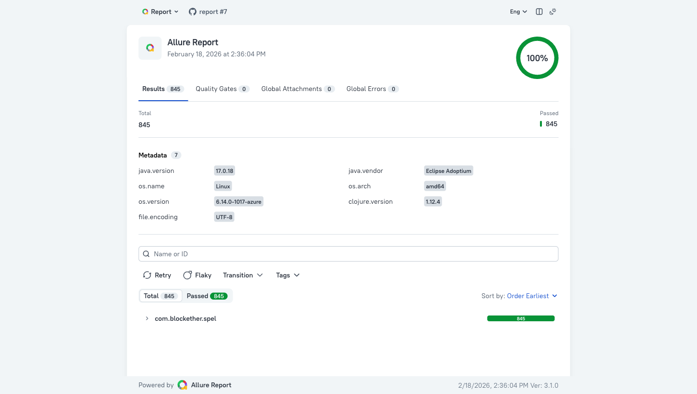

<!-- Installation instructions for spel, a browser automation CLI tool -->

<p align="center">
  
</p>

<div align="center">
<i>spel</i> - A command-line tool that lets you control a browser from the terminal.
<br/>
<sub>Open pages · click buttons · fill forms · take screenshots · scrape content · run E2E tests · generate reports — all from simple shell commands.</sub>
</div>

<div align="center">
  <h2>
    <a href="https://clojars.org/com.blockether/spel"></a>
    <a href="https://github.com/Blockether/spel/blob/main/LICENSE">
      
    </a>
  </h2>
</div>

<div align="center">
<h3>

[What is spel?](#what-is-spel) • [Quick Start](#quick-start) • [CLI Examples](#cli-examples) • [Building from Source](#building-from-source)

</h3>
</div>

<table>
<tr>
<td width="25%" align="center"><b>Page Snapshots</b></td>
<td width="25%" align="center"><b>Inline&nbsp;Scripting</b></td>
<td width="25%" align="center"><b>Visual Annotations</b></td>
<td width="25%" align="center"><b>Test Reporting</b></td>
</tr>
<tr>
<td></td>
<td></td>
<td></td>
<td></td>
</tr>
</table>

## What is spel?

**spel is a command-line tool that controls a real browser.** You type commands in your terminal, and spel opens pages, clicks buttons, fills forms, takes screenshots, reads page content, and more. Think of it as a remote control for Chrome/Firefox/WebKit that works from the shell.

**Concrete example** — scrape a page and get its content as Markdown:

```bash
spel open https://news.ycombinator.com
spel markdownify                          # page content as clean Markdown
spel screenshot front-page.png            # take a screenshot
spel close
```

**Why not just use Puppeteer / Playwright directly?**

- **No Node.js, no `node_modules`, no 100 MB binary downloads.** spel is a single self-contained binary (~71 MB). It uses Playwright Java under the hood, but you don't need to set up a Node project, manage npm dependencies, or deal with binary downloads on every `npm install`.
- **Persistent browser session.** spel runs a background daemon — your browser stays open between commands. This makes it fast for interactive use.
- **Works as a CLI, not just a library.** You don't need to write a script to automate a browser. Just type `spel open`, `spel click`, `spel fill` in your terminal.

**Why not just use Claude Code's `--chrome` / browser MCP tools?**

You can! If Claude Code's built-in browser works for you, keep using it. spel offers more when you need:

- **Persistent sessions** across multiple commands (the browser stays open)
- **Accessibility snapshots** — a structured, numbered view of the page that's better than raw HTML
- **E2E test generation** — record a browser session and turn it into a test
- **Allure reports** — detailed test reports with traces, screenshots, and network inspection
- **CI integration** — run the same tests headlessly in CI with proper reporting
- **Three browser engines** — Chromium, Firefox, and WebKit

**Who is this for?**

| You want to... | spel gives you... |
|----------------|-------------------|
| Automate a browser from the terminal | `spel open`, `spel click`, `spel fill`, `spel screenshot` |
| Scrape page content | `spel markdownify`, `spel snapshot`, `spel get text` |
| Write E2E tests | Clojure test framework with Allure reports, or record-and-generate |
| Control a browser from scripts or the terminal | CLI commands + accessibility snapshots for reliable interaction |
| Run browser tests in CI | Headless mode + Allure reporting + video recording |
| Automate where CDP is disabled (corporate/managed browsers) | `spel bridge` — embed `spel.js` + drive over a loopback bridge |
| Automate an iOS app or inspectable WKWebView | `spel --provider ios --bundle-id ...` — Appium/XCUITest on a real Simulator |

## Rationale

spel wraps Playwright Java with idiomatic Clojure: maps for options, anomaly maps for errors, `with-*` macros for lifecycle, and a native CLI binary for instant browser automation.

- **Single binary, no ecosystem baggage**: One download, no `node_modules`, no npm, no transitive dependency surprises. Install the binary, install browsers, done.
- **Persistent daemon**: First command auto-starts a background browser. Subsequent commands reuse it. No cold-start on every invocation — fast enough for interactive loops.
- **Accessibility snapshots**: Pages are represented as structured, numbered documents (not raw HTML). You can reference elements by number — no brittle CSS selectors.
- **Record, then generate**: Capture any browser session to JSONL and auto-generate idiomatic Clojure tests or reusable scripts.
- **Allure reports with network inspection**: Full Allure reporting with Playwright traces, network visualization (method, status, headers, body), and visual diffs.
- **API testing built in**: Intercept, assert, and inspect HTTP traffic in the same tool as your browser tests.
- **Three browser engines**: Chromium, Firefox, and WebKit — full Playwright API coverage.
- **Inline Clojure scripting**: Run arbitrary Clojure expressions mid-session via `eval-sci` — not just shell commands, but real code.

## Quick Start

### Install

**Clojure library:**

```clojure
;; deps.edn
{:deps {com.blockether/spel {:mvn/version "0.9.8"}}}
```

**Native CLI (download from GitHub releases):**

```bash
# macOS (Apple Silicon)
curl -LO https://github.com/Blockether/spel/releases/latest/download/spel-macos-arm64
chmod +x spel-macos-arm64 && mv spel-macos-arm64 ~/.local/bin/spel

# Linux (amd64)
curl -LO https://github.com/Blockether/spel/releases/latest/download/spel-linux-amd64
chmod +x spel-linux-amd64 && mv spel-linux-amd64 ~/.local/bin/spel

# Linux (arm64)
curl -LO https://github.com/Blockether/spel/releases/latest/download/spel-linux-arm64
chmod +x spel-linux-arm64 && mv spel-linux-arm64 ~/.local/bin/spel

# Windows (PowerShell)
Invoke-WebRequest -Uri https://github.com/Blockether/spel/releases/latest/download/spel-windows-amd64.exe -OutFile spel.exe
Move-Item spel.exe "$env:LOCALAPPDATA\Microsoft\WindowsApps\spel.exe"
```

Add `~/.local/bin` to your PATH:

```bash
export PATH="$HOME/.local/bin:$PATH"  # add to ~/.bashrc or ~/.zshrc
```

**macOS Gatekeeper** (binaries are not Apple-signed):

```bash
xattr -d com.apple.quarantine ~/.local/bin/spel
```

**Post-install:**

```bash
spel install   # install browsers
spel version   # verify installation
```

### Guided Installation

1. Download the correct binary for your platform from GitHub Releases.
2. Make it executable and place it in your PATH.
3. Run `spel install` to install browsers.
4. Run `spel version` to verify.
5. Test with `spel open https://example.com` and then `spel close`.

<details>
<summary>Corporate Proxy / Custom CA Certificates</summary>

If you're behind a corporate SSL-inspecting proxy (Zscaler, Netskope, etc.), `spel install` may fail with "PKIX path building failed". Set these env vars **before** running `spel install`:

| Env Var | Format | On missing file | Description |
|---------|--------|----------------|-------------|
| `SPEL_CA_BUNDLE` | PEM file | Error | Extra CA certs (merged with defaults) |
| `NODE_EXTRA_CA_CERTS` | PEM file | Warning, skips | Shared with Node.js subprocess |
| `SPEL_TRUSTSTORE` | JKS/PKCS12 | Error | Truststore (merged with defaults) |
| `SPEL_TRUSTSTORE_TYPE` | String | — | Default: JKS |
| `SPEL_TRUSTSTORE_PASSWORD` | String | — | Default: empty |

```bash
export SPEL_CA_BUNDLE=/path/to/corporate-ca.pem
export NODE_EXTRA_CA_CERTS=/path/to/corporate-ca.pem
spel install --with-deps
```

All options merge with built-in defaults — public CDN certs continue to work.

</details>

<details>
<summary>Environment Variables</summary>

All env vars are optional. **CLI flags always take priority over env vars.**

**Browser**

| Env Var | CLI equivalent | Description |
|---------|---------------|-------------|
| `SPEL_BROWSER` | `--browser` | Browser engine: `chromium` (default), `firefox`, `webkit` |
| `SPEL_CHANNEL` | `--channel` | Chromium channel: `chrome`, `msedge`, `chrome-beta`, etc. |
| `SPEL_PROFILE` | `--profile` | Chrome/Edge user data directory (full profile: extensions, passwords, bookmarks) |
| `SPEL_LOAD_STATE` | `--load-state` | Playwright storage state JSON path (alias: `SPEL_STORAGE_STATE`) |
| `SPEL_EXECUTABLE_PATH` | `--executable-path` | Custom browser binary path |
| `SPEL_USER_AGENT` | `--user-agent` | Custom user agent string |
| `SPEL_STEALTH` | `--no-stealth` | Set to `false` to disable stealth mode (ON by default) |

**Session**

| Env Var | CLI equivalent | Description |
|---------|---------------|-------------|
| `SPEL_SESSION` | `--session` | Session name (default: `default`) |
| `SPEL_JSON` | `--json` | Set to `true` for JSON output |
| `SPEL_TIMEOUT` | `--timeout` | Command timeout in milliseconds |

**Network**

| Env Var | CLI equivalent | Description |
|---------|---------------|-------------|
| `SPEL_PROXY` | `--proxy` | Proxy server URL |
| `SPEL_PROXY_BYPASS` | `--proxy-bypass` | Proxy bypass patterns |
| `SPEL_HEADERS` | `--headers` | Default HTTP headers (JSON string) |
| `SPEL_IGNORE_HTTPS_ERRORS` | `--ignore-https-errors` | Set to `true` to ignore HTTPS errors |

**SSL/TLS**

| Env Var | CLI equivalent | Description |
|---------|---------------|-------------|
| `SPEL_CA_BUNDLE` | — | PEM file with extra CA certs (merged with defaults) |
| `NODE_EXTRA_CA_CERTS` | — | PEM file, also respected by Node.js subprocess |
| `SPEL_TRUSTSTORE` | — | JKS/PKCS12 truststore path |
| `SPEL_TRUSTSTORE_TYPE` | — | Truststore type (default: JKS) |
| `SPEL_TRUSTSTORE_PASSWORD` | — | Truststore password |

**Testing**

| Env Var | CLI equivalent | Description |
|---------|---------------|-------------|
| `SPEL_INTERACTIVE` | — | Set to `true` for headed mode in test fixtures |
| `SPEL_SLOW_MO` | — | Slow motion delay in ms for test fixtures |
| `SPEL_ALLURE_CWD` | — | Working directory for Allure CLI process (set to `/tmp` on read-only filesystems like AWS Lambda) |

**Daemon Lifecycle**

| Env Var | CLI equivalent | Description |
|---------|---------------|-------------|
| `SPEL_SESSION_IDLE_TIMEOUT` | — | Auto-shutdown daemon after this many ms of inactivity (default: `1800000` = 30 min, `0` disables) |
| `SPEL_CDP_IDLE_TIMEOUT` | — | Auto-shutdown after CDP disconnect if no reconnect (ms, default: `1800000`, `0` disables) |
| `SPEL_CDP_LOCK_WAIT` | — | Max seconds to wait for CDP route lock release (default: `120`, `0` = fail immediately) |
| `SPEL_CDP_LOCK_POLL_INTERVAL` | — | Poll interval in seconds when waiting for CDP route lock (default: `2`) |

**Advanced**

| Env Var | CLI equivalent | Description |
|---------|---------------|-------------|
| `SPEL_AUTO_CONNECT` | `--auto-connect` | Set to any value to auto-discover Chrome CDP |
| `SPEL_AUTO_LAUNCH` | `--auto-launch` | Set to any value to auto-launch browser with debug port (per-session isolation) |
| `SPEL_CDP` | `--cdp` | Connect via Chrome DevTools Protocol URL |
| `SPEL_ARGS` | `--args` | Extra Chromium launch args (comma-separated) |
| `SPEL_DRIVER_DIR` | — | Override Playwright browser driver directory |
| `SPEL_DEBUG` | `--debug` | Set to `true` for debug logging |

</details>

### CLI Examples

The CLI is the primary way to use spel. The first command auto-starts a background browser daemon; subsequent commands reuse the same browser session.

**Navigate and interact:**

```bash
spel open https://example.org             # open a page
spel click "text=More information"        # click a link by text
spel fill "#search" "browser automation"  # fill an input field
spel press Enter                          # press a key
spel screenshot result.png                # take a screenshot
spel close                                # close the session
```

**Read page content:**

```bash
spel get title                            # page title
spel get text                             # all visible text
spel get html                             # full HTML
spel markdownify                          # page as clean Markdown
spel snapshot -i                          # accessibility snapshot with numbered refs
```

**Multiple sessions in parallel:**

```bash
spel --session shop open https://shop.example.com
spel --session docs open https://docs.example.com
spel --session shop screenshot shop.png
spel --session docs screenshot docs.png
```

**Use your real Chrome profile** (with extensions, saved passwords, etc.):

```bash
export SPEL_CHANNEL=chrome
export SPEL_PROFILE="$HOME/.config/google-chrome/Default"
spel open https://github.com    # opens with your logged-in session
```

Run `spel --help` for the full command list (~150 commands covering navigation, interaction, content extraction, network interception, cookies, tabs, frames, debugging, and more).

**No CDP? Drive a page over the loopback bridge:**

Where the Chrome DevTools Protocol is disabled (locked-down corporate machines,
managed browsers), classic CDP automation cannot attach. `spel bridge` instead
serves a tiny, dependency-free engine (`spel.js`) plus a loopback SSE/POST
transport on `127.0.0.1` — no DevTools Protocol, no extension, no bundler.
Loopback traffic never leaves the machine, so an embedded page can be driven
from spel anyway.

```bash
spel bridge                        # serve spel.js + the transport on 127.0.0.1:8787
spel bridge use                    # route regular `spel <verb>` through the bridge
spel bridge --eject -o spel.js     # unpack the engine (also ships inside the binary)
spel bridge --eject --bookmarklet  # a draggable javascript: loader for any page
```

Embed it (load first in `<head>` for full network capture):

```html
<script src="http://127.0.0.1:8787/spel.js"></script>
<script>window.__spel.connect({url:"http://127.0.0.1:8787/spel"})</script>
```

The engine installs `window.__spel` with one `invoke(command)` covering ~80
verbs (click/fill/type, snapshot refs, ARIA, checks, in-page fetch/XHR network
capture) plus an overlay element picker (**Ctrl+Shift+L**). It cannot do what
needs CDP (real route/mock, cross-origin frames, OS-level tabs/downloads).
Details: `spel bridge --help`.

**iOS applications and hybrid WKWebViews in a Simulator:**

With `--provider ios`, spel binds Appium/XCUITest to a specific installed app
(or installs a simulator-built `.app`). Sessions normally remain in
`NATIVE_APP`, where compact XCTest snapshots provide clickable `@refs`,
native semantic roles, and Appium selectors:

```bash
spel --provider ios --bundle-id com.example.app snapshot -i
spel click @e1a2b3                                # native XCTest ref
spel click 'accessibility-id=Sign in'             # or id=/role=/xpath=/predicate=
spel get text @e1a2b3 && spel get attr @e1a2b3 value
spel wait 'role=button' --timeout 10000
spel click 200 400 && spel scroll down 400
```

Use SCI for provider setup, lifecycle operations, and temporary WebView work:

```clojure
(spel/ios-doctor)
(spel/ios-devices)

(spel/with-webview-context
  {:title (spel/title)
   :url (spel/url)
   :button-count (spel/count-of "button")
   :metadata (spel/evaluate "window.checkoutMetadata")})

(spel/with-webview-context
  {:timeout-ms 15000
   :context "WEBVIEW_com.example.app"}
  {:title (spel/title)
   :metadata (spel/evaluate "window.checkoutMetadata")})
;; The exact previous context has been restored here.
```

Body expressions such as `spel/evaluate` and other DOM operations are
evaluated only after the temporary WebView becomes active. The final body
value is returned unchanged, and the exact prior context is restored after
success or failure. WKWebView DOM access requires the app to set
`isInspectable = true` (iOS 16.4+); native XCTest automation works without it.

Use `--app build/My.app` instead of `--bundle-id` to install a Simulator
build. Device selection uses `--device`, `--udid`, or `--platform-version`;
`--appium-url` reuses an external server. SCI exposes application lifecycle,
installation, deep-link, permission, and keyboard functions. Requires macOS,
Xcode, and Appium (`npm install -g appium && appium driver install xcuitest`).
Playwright-only features such as CDP, tracing, network mocking, frames, and
tabs return explicit capability errors.

### Clojure Library

spel is also a Clojure library for writing browser automation and tests programmatically:

```clojure
(require '[com.blockether.spel.core :as core]
         '[com.blockether.spel.page :as page])

(core/with-testing-page [pg]
  (page/navigate pg "https://example.org")
  (page/title pg))
;; => "Example Domain"
```

Device emulation:

```clojure
(core/with-testing-page {:device :iphone-14 :locale "fr-FR"} [pg]
  (page/navigate pg "https://example.org"))
```

Combined browser + API testing (shared Playwright trace):

```clojure
(core/with-testing-page [pg]
  (page/navigate pg "https://example.org/login")
  (core/api-get (core/page-api pg) "/api/me"))
```

### API Testing & Playwright-Style Tests

**Write browser and API tests side-by-side:**
spel lets you write browser tests (open pages, click buttons, verify DOM) and API tests (call endpoints, check responses) using the same framework. You get full Playwright traces for both.

**API testing on its own:**

```clojure
(core/with-testing-api {:base-url "https://api.example.org"} [ctx]
  (core/api-get ctx "/users"))
```

**Combine browser + API for a single trace:**
You can link UI and API actions within the same test, ensuring one trace covers front-end and back-end steps:

```clojure
(core/with-testing-page [pg]
  (page/navigate pg "https://example.org/login")
  (core/api-get (core/page-api pg) "/api/me"))

(core/with-testing-page [pg]
  (page/navigate pg "https://example.org/login")
  (core/with-page-api pg {:base-url "https://api.example.org"} [ctx]
    (core/api-get ctx "/me")))
```

**Retry/polling logic built in:**
To handle flaky endpoints or wait for backend jobs:

```clojure
(core/with-retry {}
  (core/api-get ctx "/flaky-endpoint"))

(core/with-retry {:max-attempts 10 :delay-ms 1000 :backoff :fixed
                  :retry-when (core/retry-guard #(= "ready" (:status %)))}
  (core/api-get ctx "/job/123"))
```

> **Important:** Do not nest `with-testing-page` inside `with-testing-api` (or vice versa). Each creates its own Playwright instance, browser, and context, so you end up with separate traces. Use `page-api` or `with-page-api` when you want UI and API steps in one trace.

**Allure reporting:**
Browser and API tests can feed the same Allure report with traces, screenshots, steps, and network inspection, so one run tells the whole story.

See the [full API reference](resources/com/blockether/spel/templates/skills/spel/references/FULL_API.md), [browser options](resources/com/blockether/spel/templates/skills/spel/references/BROWSER_OPTIONS.md), [Allure reporting](resources/com/blockether/spel/templates/skills/spel/references/ALLURE_REPORTING.md), and [API testing](resources/com/blockether/spel/templates/skills/spel/references/API_TESTING.md).


## Test Reporting

Generate rich HTML reports with embedded screenshots, traces, and test results via Allure.

```clojure
(def ctx (core/new-context browser {:record-video-dir "videos"}))
```

See [PDF, stitch, and video options](resources/com/blockether/spel/templates/skills/spel/references/PDF_STITCH_VIDEO.md).

## Test Generation (Codegen)

Record browser sessions and transform them to idiomatic Clojure code.

```bash
spel codegen record -o recording.jsonl https://example.org
spel codegen recording.jsonl > my_test.clj
```

See [codegen CLI reference](resources/com/blockether/spel/templates/skills/spel/references/CODEGEN_CLI.md) for full actions and output formats.

## Building from Source

```bash
# Install browsers (via Playwright Java CLI)
clojure -M -e "(com.microsoft.playwright.CLI/main (into-array String [\"install\" \"--with-deps\"]))"

# Build JAR
clojure -T:build jar

# Build native image (requires GraalVM)
clojure -T:build native-image

# Run tests
make test
make test-allure

# Start REPL
make repl
```

## Changelog

See [CHANGELOG.md](CHANGELOG.md).

## License

Apache License 2.0 — see [LICENSE](LICENSE).
