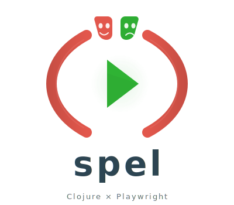
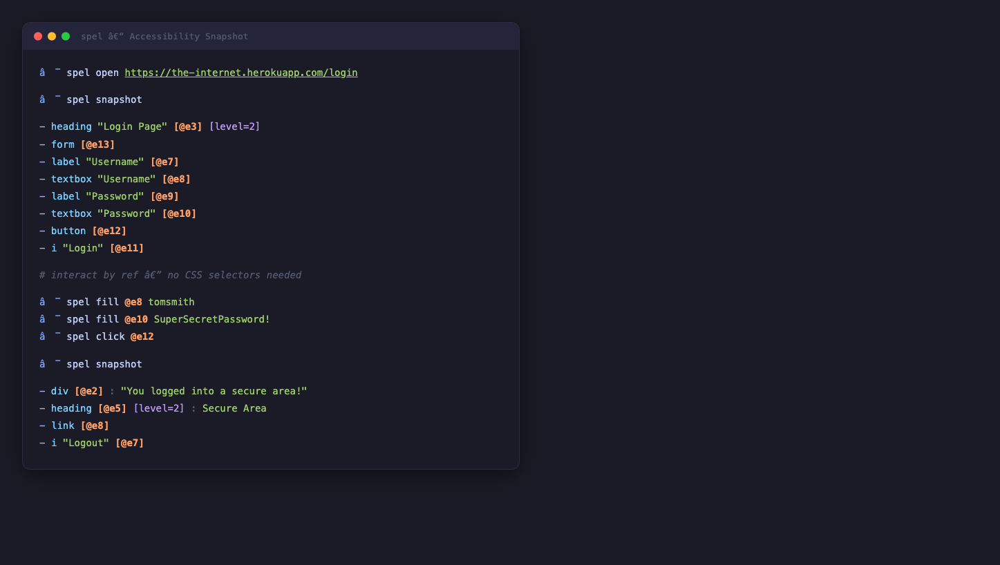
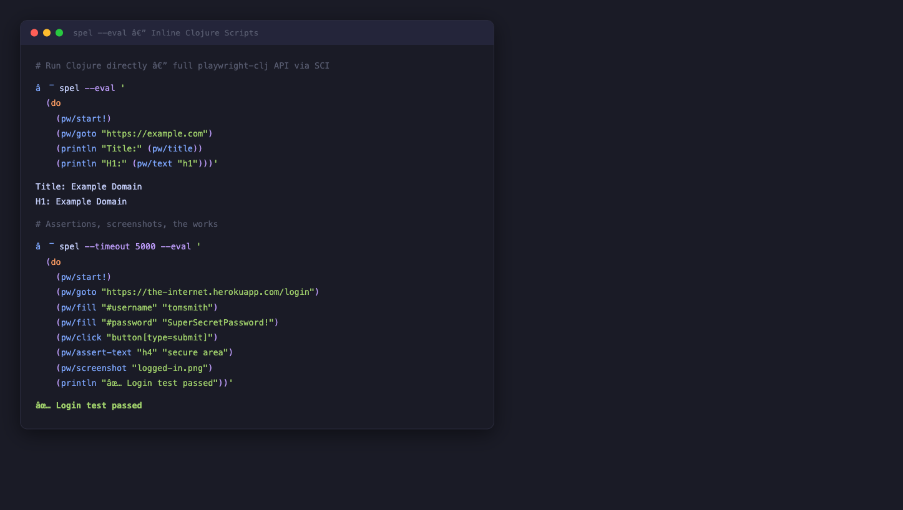
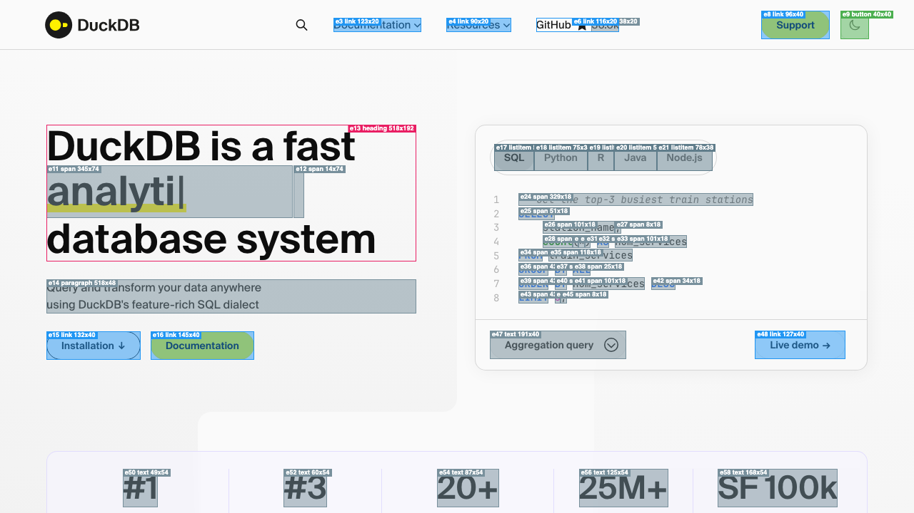
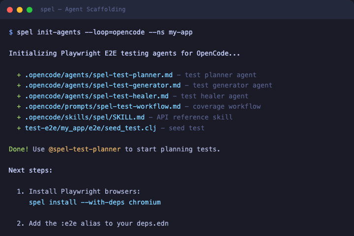

<p align="center">
  
</p>

<div align="center">
<i>spel</i> - The Swiss Army Knife browser tool for AI agents and Clojure developers.
<br/>
<sub>Browser automation · E2E and API testing · Allure reporting · Accessibility snapshots · Inline Clojure scripting · Record and Generate - one native binary, three browser engines.</sub>
</div>

<div align="center">
  <h2>
    <a href="https://clojars.org/com.blockether/spel"></a>
    <a href="https://github.com/Blockether/spel/blob/main/LICENSE">
      
    </a>
  </h2>
</div>

<div align="center">
<h3>

[Rationale](#rationale) • [Quick Start](#quick-start) • [Agent Scaffolding](#agent-scaffolding)

</h3>
</div>

<table>
<tr>
<td width="25%" align="center"><b>Accessibility Snapshots</b></td>
<td width="25%" align="center"><b>Inline&nbsp;Clojure&nbsp;via&nbsp;eval-sci</b></td>
<td width="25%" align="center"><b>Visual Annotations</b></td>
<td width="25%" align="center"><b>Agent Scaffolding</b></td>
</tr>
<tr>
<td></td>
<td></td>
<td></td>
<td></td>
</tr>
</table>

## Rationale

Playwright's Java API is imperative and verbose — option builders, checked exceptions, manual resource cleanup. Clojure deserves better. And AI agents deserve more than a shell wrapper.

spel wraps Playwright Java with idiomatic Clojure: maps for options, anomaly maps for errors, `with-*` macros for lifecycle, and a native CLI binary for instant browser automation. It does everything a modern agentic workflow needs — in one tool.

- **Swiss Army Knife for agents**: Browser automation, API testing, test reporting, agentic search and verification, accessibility snapshots, inline code execution, and test generation — all in a single native binary. No stitching tools together.
- **Agentic by design**: Accessibility snapshots with numbered refs let AI agents see the page as a structured document, not raw HTML. Persistent daemon, `eval-sci` scripting, and zero brittle CSS selectors — agents reason and act in a loop without restarting.
- **Inline Clojure execution**: Run arbitrary Clojure expressions in the browser context via `eval-sci` — mix business logic with automation, call any GraalVM-bound function, compose scripts on the fly. No other browser tool lets an agent write and execute real code mid-session.
- **Record, then generate**: Capture any browser session to JSONL and auto-generate idiomatic Clojure tests or reusable scripts. Record once, replay forever.
- **Allure reports with network inspection**: Full Allure reporting with embedded Playwright traces, network request/response visualization (method, status, headers, JSON body), and visual diffs. Debug failures from the report, not from logs.
- **API testing built in**: Intercept, assert, and inspect HTTP traffic in the same tool as your browser tests — no separate client needed.
- **Native CLI binary**: GraalVM native image, zero JVM startup, persistent daemon — fast enough for interactive agentic loops and CI alike.
- **Not a port**: Wraps Playwright Java directly — full API coverage, all three engines (Chromium, Firefox, WebKit).

## Quick Start

### Install

**Clojure library:**

```clojure
;; deps.edn
{:deps {com.blockether/spel {:mvn/version "0.6.3"}}}
```

**Native CLI (download from GitHub releases):**

```bash
# macOS (Apple Silicon)
curl -LO https://github.com/Blockether/spel/releases/latest/download/spel-macos-arm64
chmod +x spel-macos-arm64 && mv spel-macos-arm64 ~/.local/bin/spel

# Linux (amd64)
curl -LO https://github.com/Blockether/spel/releases/latest/download/spel-linux-amd64
chmod +x spel-linux-amd64 && mv spel-linux-amd64 ~/.local/bin/spel

# Linux (arm64)
curl -LO https://github.com/Blockether/spel/releases/latest/download/spel-linux-arm64
chmod +x spel-linux-arm64 && mv spel-linux-arm64 ~/.local/bin/spel

# Windows (PowerShell)
Invoke-WebRequest -Uri https://github.com/Blockether/spel/releases/latest/download/spel-windows-amd64.exe -OutFile spel.exe
Move-Item spel.exe "$env:LOCALAPPDATA\Microsoft\WindowsApps\spel.exe"
```

Add `~/.local/bin` to your PATH:

```bash
export PATH="$HOME/.local/bin:$PATH"  # add to ~/.bashrc or ~/.zshrc
```

**macOS Gatekeeper** (binaries are not Apple-signed):

```bash
xattr -d com.apple.quarantine ~/.local/bin/spel
```

**Post-install:**

```bash
spel install   # install browsers
spel version   # verify installation
```

### Guided Installation (for LLM agents)

<details>
<summary>Step-by-step agent-driven install guide</summary>

If you're an LLM agent installing spel for a user, follow these steps. Ask questions where indicated — adapt to the user's answers.

#### Step 1: Detect platform and install binary

Detect the user's OS and architecture, then download the correct binary:

| Platform | Binary name |
|----------|------------|
| macOS Apple Silicon | `spel-macos-arm64` |
| Linux x86_64 | `spel-linux-amd64` |
| Linux ARM64 | `spel-linux-arm64` |
| Windows x86_64 | `spel-windows-amd64.exe` |

**Agent:**
1. Run `uname -s` + `uname -m` (Unix) or check `$env:PROCESSOR_ARCHITECTURE` (Windows)
2. Download from `https://github.com/Blockether/spel/releases/latest/download/<binary>`
3. Place in `~/.local/bin/` (Unix) or `%LOCALAPPDATA%\spel\` (Windows)
4. Make executable: `chmod +x` (Unix only)
5. On macOS: remove quarantine with `xattr -d com.apple.quarantine`
6. Ensure the install directory is in PATH — detect shell and add to the correct config file

#### Step 2: Ask — Which browser?

> "Which browser do you primarily use? **Chrome**, **Edge**, or **Brave**?"

Based on the answer, set the default channel:

| Answer | Channel |
|--------|---------|
| Chrome (default) | `chrome` (no flag needed) |
| Edge | `msedge` |
| Brave | `brave` |

Set `SPEL_CHANNEL` environment variable to the chosen channel (e.g. `msedge`, `brave`). Skip for Chrome — it's the default.

#### Step 3: Ask — Use your real browser profile?

> "Do you want spel to use your real browser profile? This gives you all your extensions, saved passwords, bookmarks, and preferences inside spel."

If **yes**, detect the profile path:

| OS | Chrome | Edge |
|----|--------|------|
| macOS | `~/Library/Application Support/Google/Chrome/Default` | `~/Library/Application Support/Microsoft Edge/Default` |
| Linux | `~/.config/google-chrome/Default` | `~/.config/microsoft-edge/Default` |
| Windows | `%LOCALAPPDATA%\Google\Chrome\User Data\Default` | `%LOCALAPPDATA%\Microsoft\Edge\User Data\Default` |

Verify the profile exists, then set:

Set `SPEL_PROFILE` environment variable to the detected path.

If **no**, skip — spel will use a fresh browser context each time.

#### Step 4: Ask — Corporate proxy?

> "Are you behind a corporate proxy (Zscaler, Netskope, etc.)? If unsure, try `spel install` first — if it fails with 'PKIX path building failed', you need this."

If **yes**:

Set both `SPEL_CA_BUNDLE` and `NODE_EXTRA_CA_CERTS` environment variables to the path of the corporate CA bundle (PEM format). Ask the user where the cert file is, or help them find it.

See the [Corporate Proxy](#corporate-proxy--custom-ca-certificates) section below for details.

#### Step 5: Install browsers

Run `spel install` to download Chromium. If the user chose Edge, also run `spel install msedge`.

#### Step 6: Ask — Automation or testing?

> "Will you use spel for **automation only** (scripting, scraping, agents) or also for **writing tests** (with assertions and Allure reports)?"

Scaffold agent skills (all 8 agents by default — use `--simplified` for the 6-agent core setup, `--only` to scaffold a subset, or `--no-tests` to skip the seed test file):

```bash
# Full scaffolding with all 8 agents (default)
spel init-agents

# All agents, no seed test or specs directory
spel init-agents --no-tests

# Scaffold only specific groups
spel init-agents --only=test          # test agents only
spel init-agents --only=automation    # browser automation agents only
spel init-agents --only=visual        # visual QA agents only
spel init-agents --only=bugfind      # adversarial bug-finding agents only
spel init-agents --only=core         # simplified 6-agent core setup
spel init-agents --simplified        # alias for --only=core
```

Choose the right loop for your coding agent:

```bash
spel init-agents --loop=opencode   # OpenCode (default)
spel init-agents --loop=claude     # Claude Code
```

#### Step 7: Verify

Run `spel version` to confirm installation. Then test with `spel open https://example.com` — it should open and return JSON. Run `spel close` after.

If the user chose to use a profile, test with their profile path to verify it works.

#### Step 8: Persist configuration

Save the user's choices so they don't need to pass flags every time. Detect their shell and OS, then write to the correct config file:

| OS | Shell | Config file |
|----|-------|-------------|
| macOS/Linux | zsh | `~/.zshrc` |
| macOS/Linux | bash | `~/.bashrc` |
| macOS/Linux | fish | `~/.config/fish/config.fish` (use `set -Ux VAR value`) |
| Windows | PowerShell | `$PROFILE` (use `[Environment]::SetEnvironmentVariable("VAR", "value", "User")`) |
| Windows | cmd | `setx VAR value` |

**Agent:** detect the shell (`echo $SHELL` on Unix, `$PSVersionTable` on Windows) and write the env vars to the correct file using the correct syntax. Do not assume bash.

</details>

<details>
<summary>Corporate Proxy / Custom CA Certificates</summary>

If you're behind a corporate SSL-inspecting proxy (Zscaler, Netskope, etc.), `spel install` may fail with "PKIX path building failed". Set these env vars **before** running `spel install`:

| Env Var | Format | On missing file | Description |
|---------|--------|----------------|-------------|
| `SPEL_CA_BUNDLE` | PEM file | Error | Extra CA certs (merged with defaults) |
| `NODE_EXTRA_CA_CERTS` | PEM file | Warning, skips | Shared with Node.js subprocess |
| `SPEL_TRUSTSTORE` | JKS/PKCS12 | Error | Truststore (merged with defaults) |
| `SPEL_TRUSTSTORE_TYPE` | String | — | Default: JKS |
| `SPEL_TRUSTSTORE_PASSWORD` | String | — | Default: empty |

```bash
export SPEL_CA_BUNDLE=/path/to/corporate-ca.pem
export NODE_EXTRA_CA_CERTS=/path/to/corporate-ca.pem
spel install --with-deps
```

All options merge with built-in defaults — public CDN certs continue to work.

</details>

<details>
<summary>Environment Variables</summary>

All env vars are optional. **CLI flags always take priority over env vars.**

| Env Var | CLI equivalent | Description |
|---------|---------------|-------------|
| **Browser** | | |
| `SPEL_BROWSER` | `--browser` | Browser engine: `chromium` (default), `firefox`, `webkit` |
| `SPEL_CHANNEL` | `--channel` | Chromium channel: `chrome`, `msedge`, `chrome-beta`, etc. |
| `SPEL_PROFILE` | `--profile` | Chrome/Edge user data directory (full profile: extensions, passwords, bookmarks) |
| `SPEL_LOAD_STATE` | `--load-state` | Playwright storage state JSON path (alias: `SPEL_STORAGE_STATE`) |
| `SPEL_EXECUTABLE_PATH` | `--executable-path` | Custom browser binary path |
| `SPEL_USER_AGENT` | `--user-agent` | Custom user agent string |
| `SPEL_STEALTH` | `--no-stealth` | Set to `false` to disable stealth mode (ON by default) |
| **Session** | | |
| `SPEL_SESSION` | `--session` | Session name (default: `default`) |
| `SPEL_JSON` | `--json` | Set to `true` for JSON output |
| `SPEL_TIMEOUT` | `--timeout` | Command timeout in milliseconds |
| **Network** | | |
| `SPEL_PROXY` | `--proxy` | Proxy server URL |
| `SPEL_PROXY_BYPASS` | `--proxy-bypass` | Proxy bypass patterns |
| `SPEL_HEADERS` | `--headers` | Default HTTP headers (JSON string) |
| `SPEL_IGNORE_HTTPS_ERRORS` | `--ignore-https-errors` | Set to `true` to ignore HTTPS errors |
| **SSL/TLS** | | |
| `SPEL_CA_BUNDLE` | — | PEM file with extra CA certs (merged with defaults) |
| `NODE_EXTRA_CA_CERTS` | — | PEM file, also respected by Node.js subprocess |
| `SPEL_TRUSTSTORE` | — | JKS/PKCS12 truststore path |
| `SPEL_TRUSTSTORE_TYPE` | — | Truststore type (default: JKS) |
| `SPEL_TRUSTSTORE_PASSWORD` | — | Truststore password |
| **Testing** | | |
| `SPEL_INTERACTIVE` | — | Set to `true` for headed mode in test fixtures |
| `SPEL_SLOW_MO` | — | Slow motion delay in ms for test fixtures |
| **Advanced** | | |
| `SPEL_AUTO_CONNECT` | `--auto-connect` | Set to any value to auto-discover Chrome CDP |
| `SPEL_CDP` | `--cdp` | Connect via Chrome DevTools Protocol URL |
| `SPEL_ARGS` | `--args` | Extra Chromium launch args (comma-separated) |
| `SPEL_DRIVER_DIR` | — | Override Playwright browser driver directory |
| `SPEL_DEBUG` | `--debug` | Set to `true` for debug logging |

</details>

### Browser Automation

```clojure
(require '[com.blockether.spel.core :as core]
         '[com.blockether.spel.page :as page])

(core/with-testing-page [pg]
  (page/navigate pg "https://example.org")
  (page/title pg))
;; => "Example Domain"
```

Pass an opts map for device emulation:

```clojure
(core/with-testing-page {:device :iphone-14 :locale "fr-FR"} [pg]
  (page/navigate pg "https://example.org"))
```

For explicit lifecycle control, `with-playwright`/`with-browser`/`with-context`/`with-page` nesting is available. See the [full API reference](.opencode/skills/spel/SKILL.md).

### API Testing & Writing Tests

**Browser testing:**

```clojure
(core/with-testing-page [pg]
  (page/navigate pg "https://example.org")
  (page/title pg))
```

**API testing:**

```clojure
(core/with-testing-api {:base-url "https://api.example.org"} [ctx]
  (core/api-get ctx "/users"))
```

**Combined UI + API** — use `page-api` or `with-page-api` to share a single Playwright trace:

```clojure
;; page-api: same context, same trace
(core/with-testing-page [pg]
  (page/navigate pg "https://example.org/login")
  (core/api-get (core/page-api pg) "/api/me"))

;; with-page-api: same context, different base-url
(core/with-testing-page [pg]
  (page/navigate pg "https://example.org/login")
  (core/with-page-api pg {:base-url "https://api.example.org"} [ctx]
    (core/api-get ctx "/me")))
```

> **Important:** Do NOT nest `with-testing-page` inside `with-testing-api` (or vice versa). Each creates its own Playwright instance, browser, and context — you get two separate traces instead of one. Use `page-api`/`with-page-api` to combine UI and API testing under a single trace.

See [SKILL.md for fixtures, steps, and attachments](.opencode/skills/spel/SKILL.md).

See [SKILL.md for fixtures, steps, and attachments](.opencode/skills/spel/SKILL.md).

### Native CLI

spel compiles to a native binary via GraalVM - no JVM startup, instant execution. The CLI provides commands for browser automation (`open`, `screenshot`, `snapshot`, `annotate`), a persistent browser daemon, session recording (`codegen`), PDF generation, and an `eval-sci` mode for inline Clojure scripting via SCI. Run `spel --help` for the full command list.

## Agent Scaffolding

Point your AI agent at spel and let it write your E2E tests.

```bash
spel init-agents                              # all 8 agents (default)
spel init-agents --loop=claude                # Claude Code
spel init-agents --only=test                  # test agents only
spel init-agents --only=automation            # browser automation agents only
spel init-agents --only=visual                # visual QA agents only
spel init-agents --only=bugfind              # adversarial bug-finding agents only
spel init-agents --only=orchestrator          # orchestrator agent only
spel init-agents --only=test,visual           # combine groups with commas
spel init-agents --only=discovery             # product discovery agents only
spel init-agents --only=core                  # simplified 6-agent core setup
spel init-agents --only=core                  # simplified 6-agent core setup
spel init-agents --simplified                 # alias for --only=core
spel init-agents --flavour=clojure-test       # clojure.test instead of Lazytest
spel init-agents --no-tests                   # all agents, skip seed test + specs
```

| Flag | Default | Purpose |
|------|---------|---------|
| `--loop TARGET` | `opencode` | Agent format: `opencode`, `claude` (`vscode` is deprecated) |
| `--only GROUPS` | — | Scaffold only specific agent groups (comma-separated): `test`, `automation`, `visual`, `bugfind`, `orchestrator`, `discovery`, `core` |
| `--simplified` | — | Use simplified 6-agent setup (equivalent to `--only=core`) |
| `--ns NS` | dir name | Base namespace for generated tests |
| `--flavour FLAVOUR` | `lazytest` | Test framework: `lazytest` or `clojure-test` |
| `--no-tests` | — | Skip seed test and specs directory — scaffold agents + SKILL only |
| `--learnings` | — | Inject learnings contracts; agents create/update `LEARNINGS.md` lazily on first write |
| `--dry-run` | — | Preview files without writing |
| `--force` | — | Overwrite existing files |
| `--test-dir DIR` | `test-e2e` | E2E test output directory |
| `--specs-dir DIR` | `test-e2e/specs` | Test plans directory |

### Orchestrator Agents

Orchestrators are smart entry points that route your request to the right specialist pipeline:

| Agent | Purpose |
| `@spel-orchestrator` | **Meta-orchestrator** — analyzes your request and routes to the right pipeline |

Just say `@spel-orchestrator test the login page` and it handles the rest.

Orchestrators are artifact-first: they should stop at explicit user-review gates and leave machine-readable handoff manifests in `orchestration/*.json` between pipeline stages.

### Subagent Groups

| Group | Agents | Use for |
| `test` | planner, writer | E2E test writing |
| `automation` | explorer, automator | Browser automation |
| `visual` | presenter | Visual content |
| `bugfind` | bug-hunter | Adversarial bug finding |
| `orchestrator` | orchestrator | Smart routing |
| `discovery` | product-analyst | Product feature inventory + coherence audit |

## Video Recording

Record browser sessions as WebM files for debugging and CI artifacts.

```clojure
(def ctx (core/new-context browser {:record-video-dir "videos"}))
```

See [recording options and test fixtures](.opencode/skills/spel/SKILL.md).

## Test Generation (Codegen)

Record browser sessions and transform them to idiomatic Clojure code.

```bash
spel codegen record -o recording.jsonl https://example.org
spel codegen recording.jsonl > my_test.clj
```

See [full actions and output formats](.opencode/skills/spel/SKILL.md).

## Building from Source

```bash
# Install browsers (via Playwright Java CLI)
clojure -M -e "(com.microsoft.playwright.CLI/main (into-array String [\"install\" \"--with-deps\"]))"

# Build JAR
clojure -T:build jar

# Build native image (requires GraalVM)
clojure -T:build native-image

# Run tests
make test
make test-allure

# Start REPL
make repl
```

## Changelog

See [CHANGELOG.md](CHANGELOG.md).

## License

Apache License 2.0 — see [LICENSE](LICENSE).
